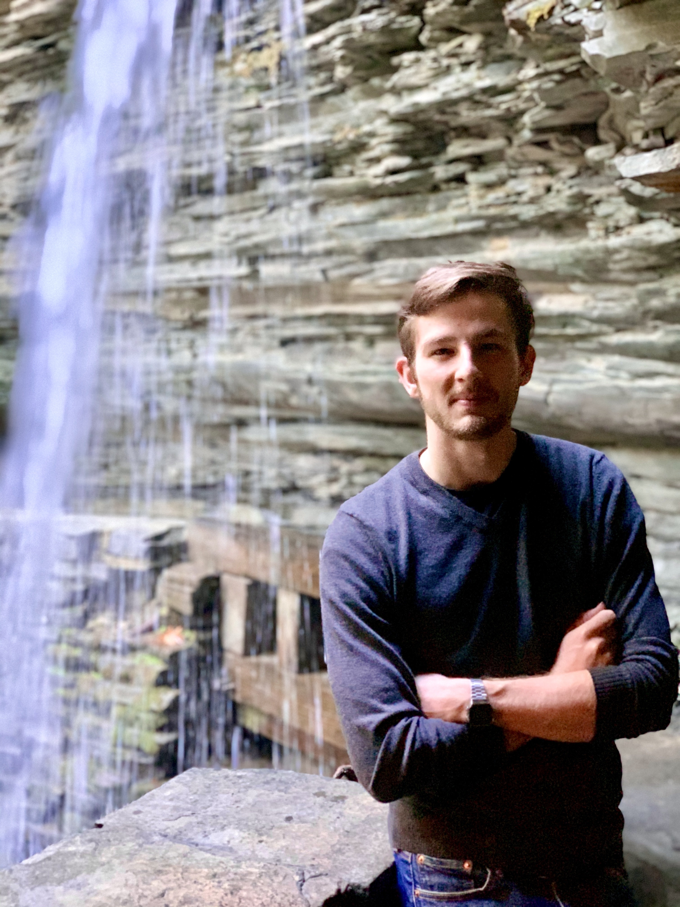
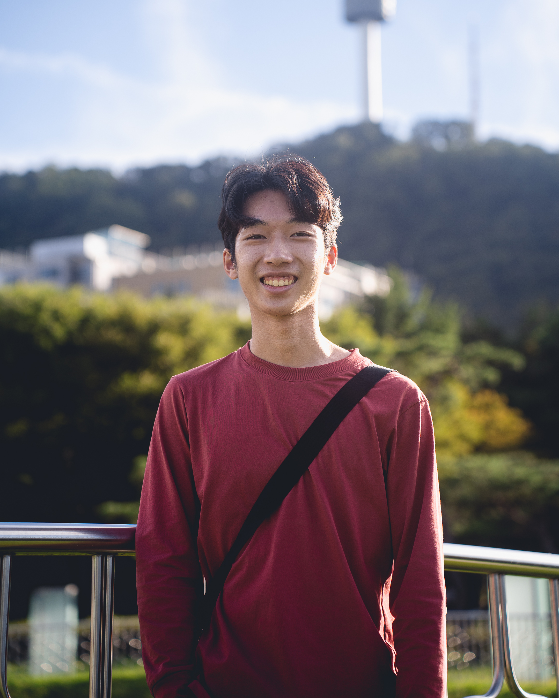

# Fast Robots @ Cornell
[Return to main page](../index.md)

## Teaching Team

### Jonathan Jaramillo

Jonathan is a visiting lecturer at Cornell in the department of Electrical and Computer Engineering, instructing ECE 4016/5160 and co-instructing ECE 2400. He recently defended his PhD in Electrical and Computer Engineering at Cornell as part of the [Collective Embodied Intelligence Lab](https://cei.ece.cornell.edu/) under Kirstin Petersen. His research interests include computer vision, systems engineering, and robotics with applications to viticulture and digital agriculture more broadly. Prior to coming to Cornell, Jonathan studied Physics and Computer Science at Houghton University, and worked as a Systems Engineer at Lockheed Martin. In his free time, Jonathan enjoys playing guitar, cooking, and restoring his vintage fiberglass camper. 

### Rafael Gottlieb 

test test test

### Jiahe Chen

test test test

### Liam Kain 

test test test

### Larry Lu 

Larry Lu is a senior from Long Island majoring in ECE and CS. He is mainly interested in working on embedded systems and robotics. He's involved with a few clubs on campus including Cornell Proyos, Assorted Aces, and Esports at Cornell. In his free time, he enjoys rock climbing and playing Teamfight Tactics.

### Jlian Prieto

test test test
