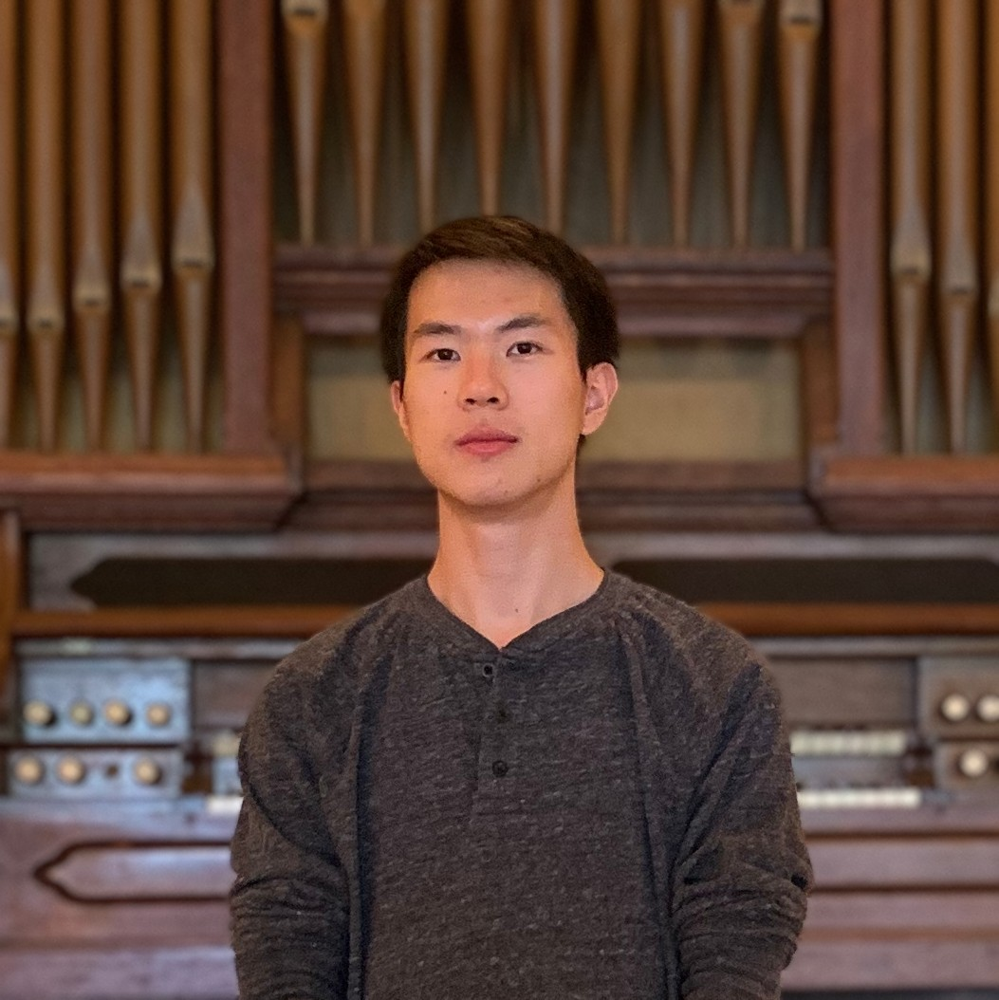
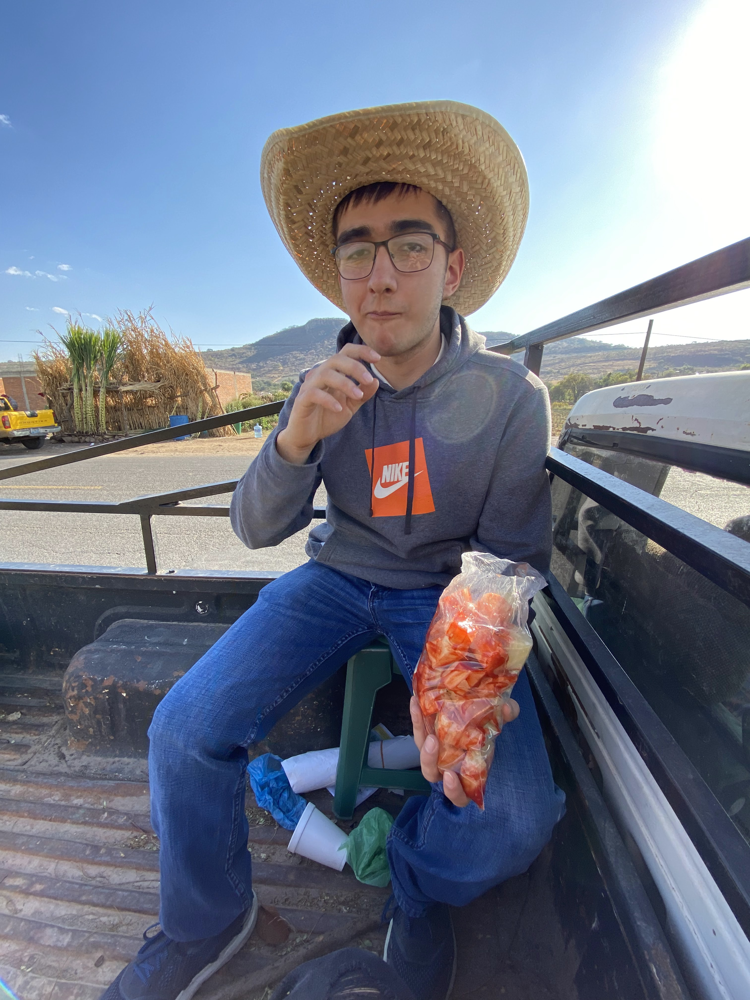

# Fast Robots @ Cornell
[Return to main page](../index.md)

## Teaching Team

### Jonathan Jaramillo

Jonathan is a visiting lecturer at Cornell in the department of Electrical and Computer Engineering, instructing ECE 4016/5160 and co-instructing ECE 2400. He recently defended his PhD in Electrical and Computer Engineering at Cornell as part of the [Collective Embodied Intelligence Lab](https://cei.ece.cornell.edu/) under Kirstin Petersen. His research interests include computer vision, systems engineering, and robotics with applications to viticulture and digital agriculture more broadly. Prior to coming to Cornell, Jonathan studied Physics and Computer Science at Houghton University, and worked as a Systems Engineer at Lockheed Martin. In his free time, Jonathan enjoys playing guitar, cooking, and restoring his vintage fiberglass camper. 

### Rafael "Rafi" Gottlieb

Rafi is an MAE MEng student interested in microcontrollers and feedback control systems. In his free time, he plays and listens to a lot of music, playing guitar but attempting to learn piano, drums, and clarinet. He also loves basketball, so you might see him at the court in Noyes.

### Jiahe Chen

Jiahe Chen is an ECE graduate student from Prof. Kirstin Petersen's Collective Embodied Intelligence Lab. His research focuses on simulation, algorithms, and theories of collective robotic construction. Before coming to Cornell, he obtained his master's degree in electrical engineering from the University of Pennsylvania and his bachelor's degree in Engineering Physics from Queen's University in Canada. Outside academics, he enjoys biking, hiking, road-tripping, and playing soccer. 

### Liam Kain 

test test test

### Larry Lu 

Larry Lu is a senior from Long Island majoring in ECE and CS. He is mainly interested in working on embedded systems and robotics. He's involved with a few clubs on campus including Cornell Proyos, Assorted Aces, and Esports at Cornell. In his free time, he enjoys rock climbing and playing Teamfight Tactics.

### Julian Prieto

Julian Prieto is an early M.Eng mechanical engineering student. In his spare time, he helps run the Cornell Foosball Club, enjoys skiing and snowboarding, and frequents Lindseth Climbing Center to do his best at rock climbing. He’s interested in automated systems and design.

### Ignacio Romo

Ignacio Romo is a senior EC student from Chicago. He likes chess.

